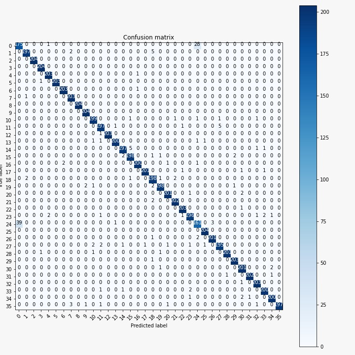
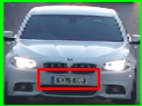
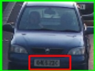
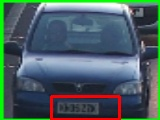
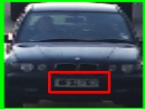
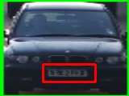

# Mosaic-PS2

This repository contains our codes of 2nd Problem Statement of Mosiac'21 sponsored by Rapid AI
 

## Problem statement:
The Problem Statement was to detecting and recognizing the licence plate of a car. 
- The main part was to segmenting out characters from a Licenceplate and recognizing them.
- There was a bonus part of detecting the licence plate in real time video.
 

## Approach:
### Segmentation:
- For character segmentation we have used a Sobel based detector for detecting the edges of the plate.
- After detecting we have segmented out the plate and then used a four point transformation to change it to Birds eye view.
- After this we have segmented out the characters from the plateusing contour detection.
- For more accurate seperation of the characters we have used a **_minima based approach_**.

### Prediction:
- For predicting the letters we have trained a model for the characters.
- The Confusion Matrix is shown here

    

### Video Processing:
- Firstly we have detected a car from a video using the YOLOv3 object detection model.
- Then we have tracked that car using OpenCV KCF Tracker until it goes out of field of view to avoid repeatation.
- Then we have detected the number plate of the car from the image taken using Haar Cascade detector.

    

    
    
    
    
    

 

## Testing:
- Install the requirements from the requirements.txt file.
- For segmenting out characters from a plate run the main.py file. It will ask for an image path whrere you provide the path.
- For tracking vehicles first download the weights and configuration file from [here](https://pjreddie.com/darknet/yolo/). Then run the tracking.py file, provide the video path.
 

## References:
- [Four Point Transformation](https://www.pyimagesearch.com/2014/08/25/4-point-opencv-getperspective-transform-example/)
- [Object Detection by YOLOv3](https://towardsdatascience.com/object-detection-using-yolov3-and-opencv-19ee0792a420)
- [Object Tracking OpenCV](https://www.pyimagesearch.com/2018/07/30/opencv-object-tracking/)
